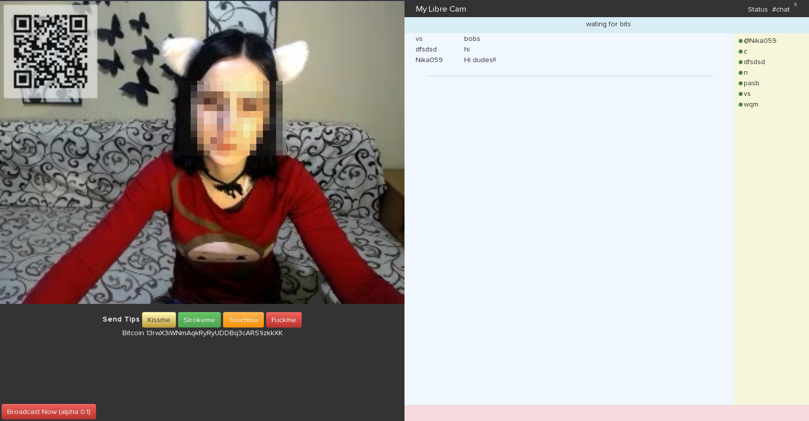

Mi cámara libre
===============

Es un clon libre y distribuido de cam4.com y myfreecams.com entre otros.

* Crea tu propia página para transmitir tu webcam en vivo
* Chatea con tus espectadores
* Recibí propinas o donaciones en bitcoins sin intermediarios

Instalar
--------

~~~
sudo apt-get install python python-twisted python-twisted-bin python-twisted-core python-twisted-runner python-twisted-names \
python-twisted-mail python-twisted-words python-twisted-web python-zope.interface ngircd vlc-nox tor qrencode
~~~

Si tu no tienes un billetera de bitcoin instala [electrum](https://electrum.org/) solo tiene que importa la llave privada en el archivo address

Ejecutar
--------

Lee y modifica el archivo config.py

~~~
./my-libre-cam.sh
~~~
