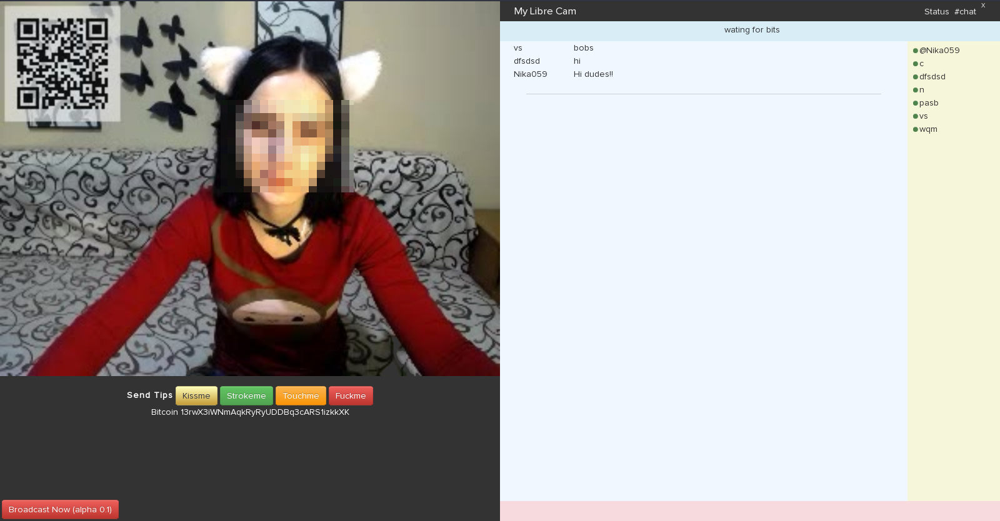

My Free Cam
===========

It is a free clone and distributed of cam4.com and myfreecams.com among others.

* It creates your own page to transmit your live webcam
* Run over tor (P2P)
* Chatea with your spectators
* Received tips or donations in bitcoins without intermediaries

Install
-------

~~~
sudo apt-get install python python-twisted python-twisted-bin \
python-twisted-core python-twisted-runner python-twisted-names \
python-twisted-mail python-twisted-words python-twisted-web \
python-zope.interface ngircd vlc-nox tor qrencode
~~~

If your do not have a wallet of bitcoin installs [electrum](https://electrum.org) and import private address

~~~
sudo pip install bitcoin
~~~

Run
---

Read and configure config.py

~~~
./my-libre-cam.sh
~~~

Donations bitcoin:13b3LtSpCfHi3sgYMPsHxsccmWgkWon7TC
